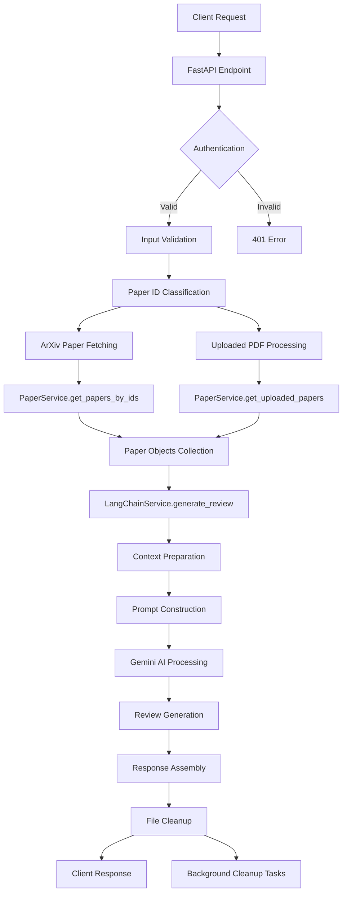

# LitXplore Review Generation Process: Complete Flow Documentation

## Overview

The LitXplore backend implements a sophisticated literature review generation system that combines arXiv paper retrieval, PDF upload processing, and AI-powered review synthesis using LangChain and Google's Gemini model. This document provides a comprehensive breakdown of the entire process from initial request to final review delivery.

## System Architecture

### Core Components

1. **FastAPI Endpoints** (`app/api/v1/endpoints/`)

   - Review generation endpoint
   - Paper management endpoints
   - Document generation endpoints

2. **Services Layer** (`app/services/`)

   - `LangChainService`: AI-powered review generation
   - `PaperService`: Paper retrieval and processing
   - `DocumentService`: PDF/LaTeX document generation

3. **Models** (`app/models/`)

   - Data structures for papers, reviews, and users
   - Pydantic validation models

4. **Core Infrastructure**
   - Authentication with Clerk
   - Database with PostgreSQL
   - File storage for uploaded PDFs

## Complete Review Generation Flow

### Phase 1: Request Initiation

#### 1.1 API Endpoint (`/api/v1/review/generate-review`)

**Location**: `app/api/v1/endpoints/review.py:20-82`

```python
@router.post("/generate-review", response_model=ReviewResponse)
async def generate_review(request: Request, review_request: ReviewRequest) -> ReviewResponse:
```

**Input Structure** (`ReviewRequest`):

```python
class ReviewRequest(BaseModel):
    paper_ids: List[str]  # Mix of arXiv IDs and upload_ prefixed IDs
    topic: str           # Research topic (3-500 characters)
    max_papers: int      # Max papers to analyze (1-20, default 10)
```

#### 1.2 Initial Validation and Setup

1. **Authentication**: User authentication via Clerk JWT tokens
2. **Input Validation**: Validates paper IDs and topic requirements
3. **Paper ID Classification**: Separates arXiv IDs from uploaded PDF IDs
   ```python
   arxiv_ids = [pid for pid in review_request.paper_ids if not pid.startswith('upload_')]
   uploaded_ids = [pid for pid in review_request.paper_ids if pid.startswith('upload_')]
   ```

### Phase 2: Paper Retrieval and Processing

#### 2.1 ArXiv Paper Fetching

**Location**: `app/services/paper_service.py:126-164`

```python
async def get_papers_by_ids(self, paper_ids: List[str]) -> List[Paper]:
```

**Process**:

1. **ID Formatting**: Removes version suffixes (v1, v2, etc.)
2. **ArXiv API Query**: Uses `arxiv.Client()` with OR-based search
3. **Data Extraction**: Converts arXiv results to internal `Paper` model
4. **Error Handling**: Retry logic with exponential backoff

**Paper Model Structure**:

```python
class Paper(BaseModel):
    id: str           # ArXiv ID or upload_{hash}
    title: str        # Paper title
    authors: List[str] # Author names
    summary: str      # Abstract/summary
    published: datetime # Publication date
    url: Optional[str] # PDF URL or local path
```

#### 2.2 Uploaded PDF Processing

**Location**: `app/services/paper_service.py:466-486`

```python
async def get_uploaded_papers(self, paper_ids: List[str]) -> List[Paper]:
```

**Process**:

1. **Hash Extraction**: Extracts content hash from `upload_{hash}` format
2. **File Verification**: Checks if PDF exists in uploads directory
3. **Metadata Retrieval**: Loads previously extracted metadata
4. **Paper Object Creation**: Constructs Paper objects from stored data

### Phase 3: LangChain Service Integration

#### 3.1 LangChain Service Initialization

**Location**: `app/services/langchain_service.py:17-49`

```python
class LangChainService:
    def __init__(self):
        self.text_splitter = RecursiveCharacterTextSplitter(
            chunk_size=settings.CHUNK_SIZE,      # Default: 1000
            chunk_overlap=settings.CHUNK_OVERLAP  # Default: 200
        )

        self.llm = ChatGoogleGenerativeAI(
            model="gemini-2.0-flash",
            google_api_key=settings.GEMINI_API_KEY,
            temperature=0.7
        )
```

**Key Components**:

- **Text Splitter**: Handles document chunking for processing
- **LLM Integration**: Google Gemini 2.0 Flash model
- **Prompt Templates**: Structured prompts for consistent output

#### 3.2 Review Generation Process

**Location**: `app/services/langchain_service.py:137-182`

```python
async def generate_review(self, papers: List[Paper], topic: str) -> str:
```

**Detailed Process**:

1. **Context Preparation**:

   ```python
   papers_context = "\n\n".join(
       f"Reference {i+1}:\nTitle: {p.title}\nAuthors: {', '.join(p.authors)}\nSummary: {p.summary}"
       for i, p in enumerate(papers)
   )
   ```

2. **Prompt Construction**: Creates comprehensive academic writing prompt with:

   - Literature review requirements
   - Citation formatting instructions
   - Structure guidelines (Introduction, Main body, Research gaps, Conclusion)
   - Academic writing standards

3. **AI Generation**:

   ```python
   response = await asyncio.to_thread(
       lambda: self.llm.invoke(prompt).content
   )
   ```

4. **Output Formatting**: Returns markdown-formatted literature review

### Phase 4: Response Assembly and Cleanup

#### 4.1 Response Construction

**Location**: `app/api/v1/endpoints/review.py:78-82`

```python
return ReviewResponse(
    review=review_text,      # Generated literature review
    citations=papers,        # List of Paper objects
    topic=review_request.topic # Original topic
)
```

#### 4.2 File Cleanup System

**Multi-layered Cleanup Strategy**:

1. **Immediate Cleanup**: Attempts cleanup right after generation
2. **Background Tasks**: Scheduled cleanup via middleware
3. **Error Handling Cleanup**: Cleanup in exception handlers
4. **Final Cleanup**: Cleanup in finally blocks

**Background Task Middleware** (`app/main.py:50-72`):

```python
class BackgroundTaskMiddleware(BaseHTTPMiddleware):
    async def _process_background_tasks(self, tasks):
        for task in tasks:
            if task['task'] == 'cleanup_pdfs':
                await cleanup_uploaded_pdfs(task['paper_ids'])
```

## Advanced Features

### PDF Upload and Processing Pipeline

#### Upload Process (`app/api/v1/endpoints/papers.py:109-178`)

1. **Security Validation**:

   - File size limits (15MB max)
   - PDF header validation
   - Malicious content detection
   - Extension verification

2. **Content Processing** (`app/services/paper_service.py:352-464`):

   ```python
   # Text extraction with LangChain PyPDFLoader
   loader = PyPDFLoader(temp_pdf_path, password=None, extract_images=False)
   pages = loader.load()
   full_text = "\n".join(page.page_content for page in pages)

   # AI-powered metadata extraction using Gemini
   prompt = """Extract the following information from this academic paper:
   1. Title
   2. Authors (comma-separated)
   3. Brief summary (2-3 sentences)"""

   response = self.llm.invoke(prompt + "\n\nText:" + full_text[:2000])
   ```

3. **Storage and Identification**:
   - Content-based hashing for unique IDs
   - File storage in uploads directory
   - Metadata extraction and caching

### Chat with Papers Feature

#### Streaming Chat Interface (`app/services/paper_service.py:215-350`)

```python
async def chat_with_paper_stream(self, paper_id: str, message: str) -> AsyncGenerator[Dict[str, Any], None]:
```

**Process**:

1. **Document Processing**: PDF loading and text chunking
2. **Vector Store Creation**: FAISS embeddings with OpenAI
3. **Conversational Chain**: LangChain ConversationalRetrievalChain
4. **Streaming Response**: Chunked response delivery

### Document Generation Pipeline

#### PDF/LaTeX Export (`app/services/document_service.py`)

1. **Content Processing**: Markdown to structured format conversion
2. **Citation Formatting**: Academic citation style
3. **PDF Generation**: ReportLab-based PDF creation
4. **Template System**: Jinja2 templates for consistent formatting

## Data Flow Diagram



## Error Handling and Resilience

### Multi-level Error Handling

1. **Service Level**: Individual service error handling with specific exceptions
2. **Endpoint Level**: HTTP exception mapping and user-friendly messages
3. **Middleware Level**: Global exception handling and logging
4. **Cleanup Level**: Ensure resource cleanup regardless of errors

### Retry Mechanisms

- **ArXiv API**: Exponential backoff for API failures
- **AI Generation**: Retry logic for transient AI service errors
- **File Operations**: Robust file handling with multiple cleanup attempts

## Performance Considerations

### Optimization Strategies

1. **Async Processing**: All I/O operations are asynchronous
2. **Chunked Processing**: Large documents processed in chunks
3. **Caching**: Redis caching for frequent operations
4. **Background Tasks**: Long-running cleanup operations moved to background
5. **Resource Management**: Proper cleanup of temporary files and connections

### Scalability Features

- **Token Expiration Handling**: Robust handling of long-running operations
- **Memory Management**: Efficient handling of large PDF files
- **Concurrent Processing**: Support for multiple simultaneous requests

## Security Measures

### Authentication and Authorization

- **Clerk Integration**: JWT-based authentication
- **User Isolation**: User-specific data access patterns
- **Token Validation**: Comprehensive JWT validation with JWKS

### File Security

- **Content Validation**: PDF header and content validation
- **Malicious Content Detection**: Basic detection of suspicious PDF content
- **Sandboxed Processing**: Isolated PDF processing environment
- **Temporary File Management**: Secure temporary file handling

## Configuration and Environment

### Key Settings (`app/core/config.py`)

```python
# LangChain Settings
CHUNK_SIZE: int = 1000
CHUNK_OVERLAP: int = 200
SIMILARITY_THRESHOLD: float = 0.75
MAX_PAPERS: int = 10

# API Keys
GEMINI_API_KEY: str
OPENAI_API_KEY: str

# Database and Redis
POSTGRES_* settings
REDIS_* settings
```

## Monitoring and Observability

### Logging Strategy

- **Structured Logging**: Consistent log formatting across services
- **Error Tracking**: Comprehensive error logging with context
- **Performance Metrics**: Request timing and resource usage
- **Cleanup Tracking**: File cleanup operation logging

### Health Checks

- **Database Connectivity**: PostgreSQL health checks
- **External Services**: ArXiv API and AI service health
- **File System**: Upload directory accessibility
- **Memory Usage**: Resource utilization monitoring

This comprehensive flow ensures robust, scalable, and secure literature review generation while maintaining excellent user experience through proper error handling, cleanup mechanisms, and performance optimization.
