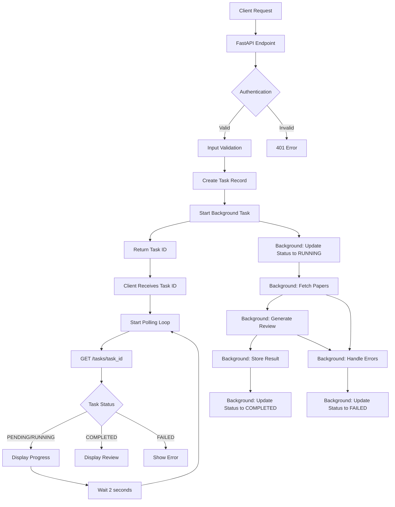

# LitXplore Review Generation Process: Complete Flow Documentation

## Overview

The LitXplore backend implements a sophisticated asynchronous literature review generation system that combines arXiv paper retrieval, PDF upload processing, and AI-powered review synthesis using LangChain and Google's Gemini model. The system uses a task-based architecture with background processing and real-time status polling to provide a responsive user experience during long-running review generation operations.

## System Architecture

### Core Components

1. **FastAPI Endpoints** (`app/api/v1/endpoints/`)

   - Review generation endpoint (task-based)
   - Task management endpoints
   - Paper management endpoints
   - Document generation endpoints

2. **Services Layer** (`app/services/`)

   - `TaskService`: Background task management and execution
   - `LangChainService`: AI-powered review generation
   - `PaperService`: Paper retrieval and processing
   - `DocumentService`: PDF/LaTeX document generation

3. **Models** (`app/models/`)

   - Data structures for papers, reviews, users, and tasks
   - Pydantic validation models
   - Task status and type enums

4. **Core Infrastructure**
   - Authentication with Clerk
   - Database with PostgreSQL (including tasks table)
   - File storage for uploaded PDFs
   - Background task processing with asyncio

## Complete Review Generation Flow

### Phase 1: Task Creation and Initiation

#### 1.1 API Endpoint (`/api/v1/review/generate-review`)

**Location**: `app/api/v1/endpoints/review.py:23-70`

```python
@router.post("/generate-review", response_model=TaskResponse)
async def generate_review(
    review_request: ReviewRequest,
    current_user: User = Depends(get_current_user),
    db: Session = Depends(get_db)
) -> TaskResponse:
```

**Input Structure** (`ReviewRequest`):

```python
class ReviewRequest(BaseModel):
    paper_ids: List[str]  # Mix of arXiv IDs and upload_ prefixed IDs
    topic: str           # Research topic (3-500 characters)
    max_papers: int      # Max papers to analyze (1-20, default 10)
```

**Output Structure** (`TaskResponse`):

```python
class TaskResponse(BaseModel):
    id: str                    # Unique task ID
    status: TaskStatus         # PENDING, RUNNING, COMPLETED, FAILED
    error_message: str         # Error description if failed
    created_at: datetime       # Task creation timestamp
    result_data: dict          # Review results when completed
```

#### 1.2 Task Creation Process

1. **Authentication**: User authentication via Clerk JWT tokens
2. **Input Validation**: Validates paper IDs and topic requirements
3. **Task Creation**: Creates a new task record in the database
   ```python
   task = await task_service.create_task(
       db=db,
       user=current_user
   )
   ```
4. **Background Task Launch**: Starts the review generation in the background
   ```python
   await task_service.start_review_generation_task(
       task_id=task.id,
       paper_ids=review_request.paper_ids,
       topic=review_request.topic,
       max_papers=review_request.max_papers
   )
   ```
5. **Immediate Response**: Returns task ID and initial status to frontend

### Phase 2: Frontend Status Polling

#### 2.1 Task Polling System

**Location**: `frontend/src/lib/hooks/api-hooks.ts:408-436`

The frontend immediately starts polling the task status using React Query:

```typescript
export function useTaskPolling(taskId: string | null, enabled = true) {
  const taskQuery = useTaskStatus(taskId, enabled);
  // ... polling logic with 2-second intervals
}
```

**Polling Behavior**:

1. **Immediate Start**: Begins polling as soon as task ID is received
2. **2-Second Intervals**: Polls every 2 seconds while task is PENDING or RUNNING
3. **Auto-Stop**: Stops polling when task reaches COMPLETED or FAILED status
4. **Status Updates**: Displays current task status and error messages
5. **Error Handling**: Handles network errors and missing tasks

#### 2.2 User Interface Updates

**Location**: `frontend/src/app/generated-review/page.tsx`

The UI provides real-time feedback during processing:

```typescript
// Simple status display with cancel option
<p className="text-sm text-muted-foreground">
  {isRunning
    ? "Generating your review... This may take a few moments."
    : "Preparing to start review generation..."}
</p>
```

### Phase 3: Background Task Execution

#### 3.1 Task Service Execution

**Location**: `app/services/task_service.py:59-141`

The background task runs independently of the HTTP request:

```python
async def _execute_review_generation(
    self,
    task_id: str,
    paper_ids: list[str],
    topic: str,
    max_papers: int
) -> None:
```

**Execution Steps**:

1. **Task Status Update**: Changes status from PENDING to RUNNING
2. **Paper Retrieval**: Fetches papers from arXiv and uploaded files
3. **Review Generation**: Uses LangChain service for AI-powered generation
4. **Result Storage**: Saves generated review in task result_data
5. **Status Completion**: Updates task status to COMPLETED or FAILED

#### 3.2 Paper Retrieval (Background)

**Location**: `app/services/paper_service.py:126-164` and `app/services/paper_service.py:466-486`

Paper retrieval happens asynchronously in the background:

1. **ID Classification**: Separates arXiv IDs from uploaded PDF IDs
2. **ArXiv Papers**: Fetches from arXiv API with retry logic
3. **Uploaded Papers**: Retrieves from local storage with metadata

### Phase 4: AI Review Generation (Background)

#### 4.1 LangChain Service Integration

**Location**: `app/services/langchain_service.py:137-182`

Review generation happens in the background with progress updates:

```python
async def generate_review(self, papers: List[Paper], topic: str) -> str:
```

**Process Steps**:

1. **Context Preparation**: Formats paper data for AI consumption
2. **Prompt Construction**: Creates academic writing prompt
3. **AI Generation**: Uses Google Gemini 2.0 Flash model

#### 4.2 Review Generation Details

**Context Preparation**:

```python
papers_context = "\n\n".join(
    f"Reference {i+1}:\nTitle: {p.title}\nAuthors: {', '.join(p.authors)}\nSummary: {p.summary}"
    for i, p in enumerate(papers)
)
```

**AI Generation**:

```python
# Generate review
review_text = await self.langchain_service.generate_review(papers, topic)

# Update task status to completed
task.status = TaskStatus.COMPLETED
```

### Phase 5: Task Completion and Result Delivery

#### 5.1 Task Result Storage

**Location**: `app/services/task_service.py:120-141`

When review generation completes, the result is stored in the task:

```python
# Store the result
result_data = {
    "review": review_text,
    "citations": [paper.dict() for paper in papers],
    "topic": topic
}
task.set_result_data(result_data)
task.status = TaskStatus.COMPLETED
db.commit()
```

#### 5.2 Frontend Result Processing

**Location**: `frontend/src/app/generated-review/page.tsx:45-70`

When polling detects completion, the frontend processes the result:

```typescript
useEffect(() => {
  if (isCompleted && result && !hasNavigated) {
    // Store the generated review
    const generatedReview = {
      review: result.review,
      citations: result.citations || [],
      topic: result.topic,
    };

    useReviewStore.getState().setGeneratedReview(generatedReview);

    // Auto-save the review
    saveReview.mutate({...});
  }
}, [isCompleted, result, hasNavigated, saveReview]);
```

#### 5.3 Automatic File Cleanup

**Background Cleanup**: Uploaded PDF files are automatically cleaned up after processing to free up storage space. This happens within the background task execution.

## Advanced Features

### Task Management System

#### Task Status Endpoints

**Location**: `app/api/v1/endpoints/tasks.py`

The system provides comprehensive task management endpoints:

1. **Get Task Status** (`GET /api/v1/tasks/{task_id}`):

   - Returns current task status, progress, and results
   - Used by frontend for polling

2. **Get User Tasks** (`GET /api/v1/tasks/`):

   - Lists all tasks for the current user
   - Supports filtering by task type and status

3. **Cancel Task** (`POST /api/v1/tasks/{task_id}/cancel`):
   - Allows users to cancel running tasks
   - Properly cleans up background processes

#### Task Database Schema

```sql
CREATE TABLE tasks (
    id VARCHAR(36) PRIMARY KEY,
    user_id INTEGER REFERENCES users(id),
    status ENUM('pending', 'running', 'completed', 'failed'),
    result_data TEXT,     -- JSON string of results
    error_message TEXT,   -- Error description if failed
    created_at TIMESTAMP
);
```

### Frontend Polling Architecture

#### React Query Integration

The frontend uses React Query for efficient task polling:

```typescript
// Automatic polling with smart intervals
refetchInterval: (query) => {
  const data = query.state.data as TaskResponse | undefined;
  if (data?.status === TaskStatus.PENDING || data?.status === TaskStatus.RUNNING) {
    return 2000; // Poll every 2 seconds
  }
  return false; // Stop polling when complete
},
```

#### User Experience Features

1. **Real-time Status**: Live status updates showing current task state
2. **Cancellation Support**: Users can cancel long-running tasks
3. **Error Handling**: Graceful handling of failures with retry options
4. **Background Processing**: Tasks continue even if user closes browser
5. **Automatic Save**: Completed reviews are automatically saved

### PDF Upload and Processing Pipeline

#### Upload Process (`app/api/v1/endpoints/papers.py:109-178`)

1. **Security Validation**:

   - File size limits (15MB max)
   - PDF header validation
   - Malicious content detection
   - Extension verification

2. **Content Processing** (`app/services/paper_service.py:352-464`):

   ```python
   # Text extraction with LangChain PyPDFLoader
   loader = PyPDFLoader(temp_pdf_path, password=None, extract_images=False)
   pages = loader.load()
   full_text = "\n".join(page.page_content for page in pages)

   # AI-powered metadata extraction using Gemini
   prompt = """Extract the following information from this academic paper:
   1. Title
   2. Authors (comma-separated)
   3. Brief summary (2-3 sentences)"""

   response = self.llm.invoke(prompt + "\n\nText:" + full_text[:2000])
   ```

3. **Storage and Identification**:
   - Content-based hashing for unique IDs
   - File storage in uploads directory
   - Metadata extraction and caching

### Chat with Papers Feature

#### Streaming Chat Interface (`app/services/paper_service.py:215-350`)

```python
async def chat_with_paper_stream(self, paper_id: str, message: str) -> AsyncGenerator[Dict[str, Any], None]:
```

**Process**:

1. **Document Processing**: PDF loading and text chunking
2. **Vector Store Creation**: FAISS embeddings with OpenAI
3. **Conversational Chain**: LangChain ConversationalRetrievalChain
4. **Streaming Response**: Chunked response delivery

### Document Generation Pipeline

#### PDF/LaTeX Export (`app/services/document_service.py`)

1. **Content Processing**: Markdown to structured format conversion
2. **Citation Formatting**: Academic citation style
3. **PDF Generation**: ReportLab-based PDF creation
4. **Template System**: Jinja2 templates for consistent formatting

## Data Flow Diagram



## Error Handling and Resilience

### Multi-level Error Handling

1. **Service Level**: Individual service error handling with specific exceptions
2. **Endpoint Level**: HTTP exception mapping and user-friendly messages
3. **Middleware Level**: Global exception handling and logging
4. **Cleanup Level**: Ensure resource cleanup regardless of errors

### Retry Mechanisms

- **ArXiv API**: Exponential backoff for API failures
- **AI Generation**: Retry logic for transient AI service errors
- **File Operations**: Robust file handling with multiple cleanup attempts

## Performance Considerations

### Optimization Strategies

1. **Async Processing**: All I/O operations are asynchronous
2. **Chunked Processing**: Large documents processed in chunks
3. **Caching**: Redis caching for frequent operations
4. **Background Tasks**: Long-running cleanup operations moved to background
5. **Resource Management**: Proper cleanup of temporary files and connections

### Scalability Features

- **Token Expiration Handling**: Robust handling of long-running operations
- **Memory Management**: Efficient handling of large PDF files
- **Concurrent Processing**: Support for multiple simultaneous requests

## Security Measures

### Authentication and Authorization

- **Clerk Integration**: JWT-based authentication
- **User Isolation**: User-specific data access patterns
- **Token Validation**: Comprehensive JWT validation with JWKS

### File Security

- **Content Validation**: PDF header and content validation
- **Malicious Content Detection**: Basic detection of suspicious PDF content
- **Sandboxed Processing**: Isolated PDF processing environment
- **Temporary File Management**: Secure temporary file handling

## Configuration and Environment

### Key Settings (`app/core/config.py`)

```python
# LangChain Settings
CHUNK_SIZE: int = 1000
CHUNK_OVERLAP: int = 200
SIMILARITY_THRESHOLD: float = 0.75
MAX_PAPERS: int = 10

# API Keys
GEMINI_API_KEY: str
OPENAI_API_KEY: str

# Database and Redis
POSTGRES_* settings
REDIS_* settings
```

## Monitoring and Observability

### Logging Strategy

- **Structured Logging**: Consistent log formatting across services
- **Error Tracking**: Comprehensive error logging with context
- **Performance Metrics**: Request timing and resource usage
- **Cleanup Tracking**: File cleanup operation logging

### Health Checks

- **Database Connectivity**: PostgreSQL health checks
- **External Services**: ArXiv API and AI service health
- **File System**: Upload directory accessibility
- **Memory Usage**: Resource utilization monitoring

## Summary of New Asynchronous Architecture

### Key Improvements

1. **Non-blocking Operations**: Frontend requests no longer block during long-running review generation
2. **Real-time Status**: Users see live status updates and can cancel operations
3. **Improved Reliability**: Background tasks continue even if user closes browser
4. **Better Error Handling**: Comprehensive error reporting and recovery options
5. **Enhanced Scalability**: Multiple review generations can run concurrently
6. **Simplified Architecture**: Reduced complexity with essential fields only

### Architecture Benefits

- **Separation of Concerns**: Request handling separated from processing
- **Fault Tolerance**: Task failures don't affect the web server
- **User Experience**: Responsive interface with progress indication
- **Resource Management**: Efficient handling of long-running operations
- **Monitoring**: Complete audit trail of all review generation tasks

### Technical Stack

- **Backend**: FastAPI + asyncio for background task processing
- **Database**: PostgreSQL with simplified tasks table for state management
- **Frontend**: React Query for efficient polling and state management
- **Real-time Updates**: 2-second polling intervals with automatic stop conditions
- **Error Recovery**: Comprehensive error handling at all levels

This comprehensive asynchronous flow ensures robust, scalable, and secure literature review generation while maintaining excellent user experience through proper task management, real-time feedback, and efficient resource utilization.
